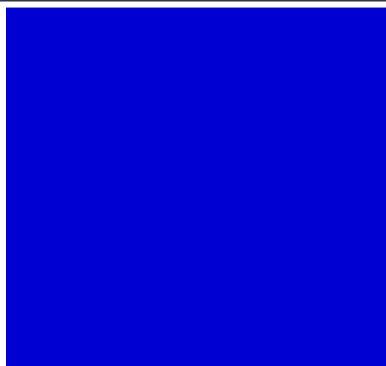
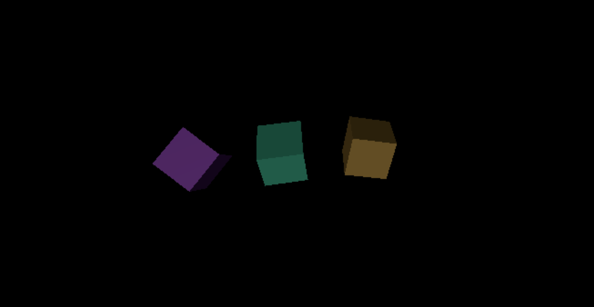

# Web Worker Canvas Library 🚀


 


## Installation 📦

To include this library in your project, simply use:

```bash
npm install workercanvas
# or
yarn add workercanvas
```

## Run Example

### [Demo Link](https://workercanvas.netlify.app/)
```bash
cd example

# if tinybuild is not installed
npm i -g tinybuild

npm i

npm start
```

## Elevate your applications with seamless off-screen rendering!

This library harnesses the power of Web Workers to take your canvas-based rendering off the main thread 🧵. Experience buttery smooth animations, complex visual computations, and responsive user interfaces—all while keeping your application's main thread free for other critical tasks 🖼️💡.

This is a pure implementation with type support, and adds about 32kb of total weight to your program when using the bundle.

## Usage 🛠️

Import the necessary components from the library and let the magic happen:

### index.js
```ts
import { Renderer, WorkerCanvas } from '../WorkerCanvas';

const canvas = document.createElement('canvas'); 
canvas.width = 800; canvas.height = 600;
canvas.style.width = '100%';
canvas.style.height = '100%';
canvas.id = 'myCanvas';
document.body.appendChild(canvas);

const workerRenderer = Renderer({
  canvas: canvas,
  context:'2d',
  worker: true, //use our prebundled worker
  _id:canvas.id,
  init:(self:WorkerCanvas,canvas,context)=>{ //init called automatically before first draw on thread
      console.log('canvas', canvas)
      canvas.addEventListener('mousedown',(ev)=>{ //ProxyListener mimics most of the necessary mouse and key events e.g. for proxying threejs controls on thread for processing event logic locally on the thread. Also includes resize events
          console.log('clicked!', ev, canvas);
      })
  },
  draw:(self:WorkerCanvas,canvas:any,context:CanvasRenderingContext2D)=>{ //render loop starts automatically on thread after receiving canvas and instructions
      context.clearRect(0,0,canvas.width, canvas.height);
      
      context.fillStyle = `rgb(0,${Math.sin(Date.now()*0.001)*255},${Math.cos(Date.now()*0.001)*255})`;
      context.fillRect(0,0,canvas.width,canvas.height);
  }                        
});
```



Start creating fluid animations and graphics right away!

There is a prebundled worker when you use 'true' or you can follow the canvas.worker.ts example to ensure functionality and provide a worker url instead. If you want to invoke threejs etc on the thread you need to define your own worker and have an alternative route to initialize what you need. 

## Types

This speeds up learning the library in your editor (e.g. VSCode)

```ts
type WorkerCanvasTransferProps = { //defined in main thread to send to worker
    canvas:HTMLCanvasElement,  
    context?:string, 
    _id?:string,
    draw?:string|((self:any,canvas:any,context:any)=>void),
    update?:string|((self:any,canvas:any,context:any,input:any)=>void),
    init?:string|((self,canvas:any,context:any)=>void),
    clear?:string|((self,canvas:any,context:any)=>void),
    transfer?:any[],
    animating?:boolean, //animation will start automatically, else you can call draw conditionally
    [key:string]:any //any transferrable props you want to use in your animation
}

type CanvasProps = { //defined in worker thread
    canvas:any, //offscreen canvas
    context?:string|CanvasRenderingContext2D|WebGL2RenderingContext|WebGLRenderingContext,
    _id:string,
    width?:number,
    height?:number,
    draw?:string|((self:any,canvas:any,context:any)=>void),
    update?:string|((self:any,canvas:any,context:any,input:any)=>void),
    init?:string|((self,canvas:any,context:any)=>void),
    clear?:string|((self,canvas:any,context:any)=>void),
    animating?:boolean,
    preventDefault?:boolean, //we can generically prevent defaults on key events (except F1-12 for debug reasons)
    [key:string]:any
}

type CanvasControls = {
    _id:string,
    draw:(props?:any,transfer?:any)=>void,
    update:(props:{[key:string]:any},transfer?:any)=>void,
    clear:()=>void,
    init:()=>void,
    stop:()=>void,
    start:()=>void,
    set:(newDrawProps:CanvasProps,transfer?:any)=>void
}

type WorkerCanvasControls = {
    worker:Worker|MessagePort,
    terminate:()=>void
} & CanvasControls

type WorkerCanvas = { //this is the object stored on the worker to track this canvas context
    graph:any, //Graph or Service class
    canvas:any, //OffscreenCanvas
    context?:CanvasRenderingContext2D|WebGL2RenderingContext|WebGLRenderingContext,
    _id:string,
    draw?:((self:WorkerCanvas,canvas:WorkerCanvas['canvas'],context:WorkerCanvas['context'])=>void), //runs in animation loop or on drawFrame calls
    update?:((self:WorkerCanvas,canvas:WorkerCanvas['canvas'],context:WorkerCanvas['context'],input:any)=>void),
    init?:((self:WorkerCanvas,canvas:WorkerCanvas['canvas'],context:WorkerCanvas['context'])=>void),
    clear?:((self:WorkerCanvas,canvas:WorkerCanvas['canvas'],context:WorkerCanvas['context'])=>void),
    animating:boolean, //animation will start automatically, else you can call draw conditionally
    [key:string]:any //any transferrable props you want to use in your animation
}


```

## Sample worker that reroutes for ThreeJS initialization




### three.worker.ts
```ts

import { workerCanvasRoutes, CanvasProps } from '../WorkerCanvas';

import * as THREE from 'three'
import { OrbitControls } from 'three/examples/jsm/controls/OrbitControls.js'
import { PickHelper } from './PickHelper'
//etc...
import { EffectComposer } from 'three/examples/jsm/postprocessing/EffectComposer.js'
import { RenderPass } from 'three/examples/jsm/postprocessing/RenderPass.js'
import { SMAAPass } from 'three/examples/jsm/postprocessing/SMAAPass.js'
import { UnrealBloomPass } from 'three/examples/jsm/postprocessing/UnrealBloomPass.js'
//minimal web worker for running offscreen canvases, 

declare var WorkerGlobalScope;

if(typeof WorkerGlobalScope !== 'undefined') {

    const routes = {
        ...workerCanvasRoutes,
        receiveThreeCanvas:function(options:CanvasProps){ //modified canvas receiver that installs desired threejs modules
                const ThreeProps = { //e.g. install these systems to 'self', which is the worker canvas
                    THREE,
                    OrbitControls,
                    EffectComposer,
                    RenderPass,
                    SMAAPass,
                    UnrealBloomPass,
                    PickHelper
                }

                Object.assign(options, ThreeProps); //install desired props to our canvas's 'self' reference

                console.log(this);
                let renderId = routes.setupCanvas(options); //the the base canvas tools do the rest, all ThreeJS tools are on self, for self contained ThreeJS renders
                //you can use the canvas render loop by default, or don't provide a draw function and just use the init and the Three animate() callback

                //let canvasopts = this.graph.CANVASES[renderId] as WorkerCanvas;

                return renderId;
            }
        //add more compatible routes that don't require graphscript
    };
    
    self.onmessage = (ev) => {
        if(ev.data.route) {
            if(Array.isArray(ev.data.args)) {
                routes[ev.data.route](...ev.data.args);
            } else routes[ev.data.route](ev.data.args);
        } //that's it! The functions handle worker communication internally
    
    }
    
}

export default self as any;


```

Then from main thread we'd call

### index.js
```ts
import { Renderer, WorkerCanvas } from '../WorkerCanvas';
import threewrkr from './three.worker' //or use a bundled path (not ts)

const canvas2 = document.createElement('canvas'); 
canvas2.width = 800; canvas2.height = 600;
canvas2.id = 'myCanvas2';
document.body.appendChild(canvas2);
const myOffscreenCanvas = Renderer(
    {
        canvas: canvas2,
        worker: threewrkr, //use our prebundled worker
        route:"receiveThreeCanvas", //set a custom function to pass our Renderer creation logic to, e.g. to create a stage for setting up ThreeJS on the worker
        _id:canvas2.id,
        context:undefined, //Threejs sets the context
        init:(self:WorkerCanvas,canvas,context)=>{

            //these are installed to the 'self' reference
            const THREE = self.THREE;
            const OrbitControls = self.OrbitControls;
            const PickHelper = self.PickHelper;
            
            const renderer = new THREE.WebGLRenderer({canvas});
            let time = 0;
            let lastFrame = Date.now();

            const fov = 75;
            const aspect = 2;
            const near = 0.1;
            const far = 100;
            
            const camera = new THREE.PerspectiveCamera(fov, aspect, near, far);
            camera.position.z = 4;

            renderer.setSize(canvas.width, canvas.height, false);
                if(camera) {
                    camera.aspect = canvas.clientWidth / canvas.clientHeight;
                    camera.updateProjectionMatrix();
                }

            const controls = new OrbitControls(camera, canvas);
            controls.target.set(0,0,0);
            controls.update();

            const scene = new THREE.Scene();

            {
                const color = 0xFFFFFF;
                const intensity = 1;
                const light = new THREE.DirectionalLight(color, intensity);
                light.position.set(-1, 2, 4);
                scene.add(light);
            }
        
            const boxWidth = 1;
            const boxHeight = 1;
            const boxDepth = 1;
            const geometry = new THREE.BoxGeometry(boxWidth, boxHeight, boxDepth);
        
            const makeInstance = (geometry, color, x) => {
                const material = new THREE.MeshPhongMaterial({
                    color,
                });
            
                const cube = new THREE.Mesh(geometry, material);
                scene.add(cube);
            
                cube.position.x = x;
            
                return cube;
            }
        
            const cubes = [
                makeInstance(geometry, 0x44aa88, 0),
                makeInstance(geometry, 0x8844aa, -2),
                makeInstance(geometry, 0xaa8844, 2),
            ];

            let getCanvasRelativePosition = (event) => {
                const rect = canvas.getBoundingClientRect();
                return {
                    x: event.clientX - rect.left,
                    y: event.clientY - rect.top,
                };
            }
        
            const pickPosition = {x: -2, y: -2};
            const pickHelper = new PickHelper();

            let setPickPosition = (event) => {
                const pos = getCanvasRelativePosition(event);
                pickPosition.x = (pos.x / canvas.clientWidth ) *  2 - 1;
                pickPosition.y = (pos.y / canvas.clientHeight) * -2 + 1;  // note we flip Y
            }
        
            let clearPickPosition = () => {
                // unlike the mouse which always has a position
                // if the user stops touching the screen we want
                // to stop picking. For now we just pick a value
                // unlikely to pick something
                pickPosition.x = -100000;
                pickPosition.y = -100000;
            }
            
            canvas.addEventListener('mousemove', setPickPosition);
            canvas.addEventListener('mouseout', clearPickPosition);
            canvas.addEventListener('mouseleave', clearPickPosition);
        
            canvas.addEventListener('touchstart', (event) => {
                // prevent the window from scrolling
                event.preventDefault();
                setPickPosition(event.touches[0]);
            }, {passive: false});
        
            canvas.addEventListener('touchmove', (event) => {
                setPickPosition(event.touches[0]);
            });
        
            canvas.addEventListener('touchend', clearPickPosition);

            canvas.addEventListener('resize', (ev) => {
                renderer.setSize(canvas.width, canvas.height, false);
                if(camera) {
                    camera.aspect = canvas.clientWidth / canvas.clientHeight;
                    camera.updateProjectionMatrix();
                }
            });

            Object.assign(self, {
                renderer,
                camera,
                controls,
                scene,
                cubes,
                time,
                lastFrame,
                pickPosition,
                pickHelper
            }); //assign these to self for the draw function

            clearPickPosition();
            //this.renderer.setAnimationLoop(this.draw);


        },
        draw:(self:WorkerCanvas,canvas:any,context:any)=>{
            let now = Date.now();
            self.time += (now - self.lastFrame) * 0.001;
            self.lastFrame = now;

            self.cubes.forEach((cube, ndx) => {
                const speed = 1 + ndx * .1;
                const rot = self.time * speed;
                cube.rotation.x = rot;
                cube.rotation.y = rot;
                });
            
                
                self.pickHelper.pick(self.pickPosition, self.scene, self.camera, self.time);
                //console.log(this.pickPosition);
                self.renderer.render(self.scene, self.camera);
        },
        clear:(self:WorkerCanvas, canvas, context) => {
            if(self.renderer) {
                self.render.domElement = null;
                self.renderer = null;
                self.composer = null;
                self.gui = null;
                self.controls = null;
                self.camera = null;
                self.scene = null;
            }
        }
    }                
);
```


## Use Cases 🎨

- **Games**: Build immersive, high-performance game engines that run in the browser.
- **Data Visualizations**: Handle large datasets and real-time data rendering without a hitch.
- **Interactive UIs**: Keep your user interfaces snappy even with complex background processes.
- **Educational Tools**: Create dynamic simulations and educational content that require heavy rendering.

---

## Documentation Directory 📂

- [WorkerCanvas](./documentation/WorkerCanvas.ts.md)
- [ProxyListener](./documentation/ProxyListener.ts.md)
- [canvas.worker](./documentation/canvas.worker.ts.md)

Each of these documents provides detailed information about the individual files, including their purposes, interfaces, types, and functions.

## Getting Started 🌟

Dive into the [docs](#documentation-directory-) to understand what each module can do for you. Then, integrate them into your project, tailor their behavior through simple configurations, and watch your web app's performance take off! 🚀

Explore the repository, and don't hesitate to contribute or reach out if you have any questions or suggestions. Together, we can push the boundaries of what's possible on the web!

---

We hope you love using this library as much as we enjoyed creating it! Happy coding! 💻✨

(Note to self: Remember to always code responsibly and keep the main thread clean! 🧹)
